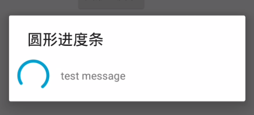
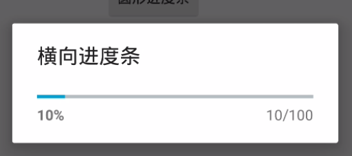

# EasyDialog
提供自定义dialog style的库，非自定义view，纯净原生!   

### 简介  
原生提供的dialog不符合设计给出的标准，我们一般情况下是去通过自定义view然后塞给dialog。但分析后发现这种方式有点过了，其实我们只需要通过style文件来替换dialog默认的布局为我们自定义的布局就可以了。这样的方式既不用改变dialog的使用方式，也不用写多余代码，只需要更改样式就能满足需求。这其实也是android的设计思想，官方一般都会把属性值暴露出来，我们做SDK的时候也应该遵循这种标准。让显示和逻辑分开，显示的内容又可以交给style定义。

### 添加依赖
1.在项目外层的build.gradle中添加JitPack仓库
  
```  
repositories {
	maven {
		url "https://jitpack.io"
	}
}
```    
2.在用到的项目中添加依赖
```  
dependencies {
	compile 'com.github.tianzhijiexian:EasyDialog:1.0.5'
}    
```   

### 使用方式   
**0. 在主题中设置默认样式（如果你想用原生的样式，可以跳过这个步骤）**  
```XML  
<resources>

    <style name="AppTheme" parent="Theme.AppCompat.Light.DarkActionBar">
        <!-- Customize your theme here. -->

        <item name="progressDialogStyle">@style/ProgressDialog</item>

        <item name="alertDialogTheme">@style/Theme.Dialog.Alert</item>

    </style>

</resources> 
```     

```XML
<style name="Theme.Dialog" parent="Theme.AppCompat.Light.Dialog">
        <item name="windowActionBar">false</item>
        <!-- 没有标题栏 -->
        <item name="windowNoTitle">true</item>

        <!--边框-->
        <item name="android:windowFrame">@null</item>

        <!--是否浮现在activity之上-->
        <item name="android:windowIsFloating">true</item>

        <!-- 是否透明 -->
        <item name="android:windowIsTranslucent">true</item>

        <!--除去title-->
        <item name="android:windowNoTitle">true</item>

        <!-- 对话框是否有遮盖 -->
        <item name="android:windowContentOverlay">@null</item>

        <!-- 对话框出现时背景是否变暗 -->
        <item name="android:backgroundDimEnabled">true</item>

        <!-- 背景颜色，因为windowBackground中的背景已经写死了，所以这里的设置无效 -->
        <item name="android:colorBackground">@color/background_floating_material_light</item>

        <!-- 着色缓存（一般不用）-->
        <item name="android:colorBackgroundCacheHint">@null</item>

        <!-- 标题的字体样式 -->
        <item name="android:windowTitleStyle">@style/RtlOverlay.DialogWindowTitle.AppCompat</item>
        <item name="android:windowTitleBackgroundStyle">@style/Base.DialogWindowTitleBackground.AppCompat</item>

        <!--对话框背景(重要)-->
        <item name="android:windowBackground">@drawable/abc_dialog_material_background_light</item>

        <!-- 动画 -->
        <item name="android:windowAnimationStyle">@style/Animation.AppCompat.Dialog</item>

        <!-- 输入法弹出时自适应 -->
        <item name="android:windowSoftInputMode">stateUnspecified|adjustPan</item>

        <item name="windowActionModeOverlay">true</item>

        <!-- 列表部分的内边距，作用于单选、多选列表 -->
        <item name="listPreferredItemPaddingLeft">20dip</item>
        <item name="listPreferredItemPaddingRight">24dip</item>

        <item name="android:listDivider">@null</item>

        <!-- 单选、多选对话框列表文字的颜色 默认：@color/abc_primary_text_material_light -->
        <item name="textColorAlertDialogListItem">#00ff00</item>

        <!-- 单选、多选对话框的分割线 -->
        <!-- dialog中listView的divider 默认：@null-->
        <item name="listDividerAlertDialog">@drawable/divider</item>

        <!-- 单选对话框的按钮图标 (默认不为null)-->
        <item name="android:listChoiceIndicatorSingle">@android:drawable/btn_radio</item>

        <!-- 对话框整体的内边距，但不作用于列表部分 默认：@dimen/abc_dialog_padding_material-->
        <item name="dialogPreferredPadding">120dp</item>

        <item name="alertDialogCenterButtons">true</item>

        <!-- 对话框内各个布局的布局文件-->
        <item name="alertDialogStyle">@style/AlertDialogStyle</item>
    </style>

    <!-- parent="@style/Theme.AppCompat.Light.Dialog.Alert" -->
    <style name="Theme.Dialog.Alert">
        <item name="windowMinWidthMajor">@dimen/abc_dialog_min_width_major</item>
        <item name="windowMinWidthMinor">@dimen/abc_dialog_min_width_minor</item>
    </style>


    <style name="AlertDialogStyle" parent="Base.AlertDialog.AppCompat">
        <!-- AlertController.class - line:168 -->

        <!-- dialog的主体布局文件，里面包含了title，message等控件 -->
        <item name="android:layout">@layout/custom_dialog_alert_material</item>
        <!-- dialog中的列表布局文件，其实就是listView -->
        <item name="listLayout">@layout/custom_dialog_list_material</item>
        <!-- dialog中列表的item的布局 -->
        <item name="listItemLayout">@layout/custom_dialog_select_item_material</item>
        <!-- 多选的item的布局 -->
        <item name="multiChoiceItemLayout">@layout/custom_dialog_select_multichoice_material</item>
        <!-- 单选的item的布局 -->
        <item name="singleChoiceItemLayout">@layout/custom_dialog_select_singlechoice_material</item>

    </style>

```

现在提供了以下几种dialog：    

**1. 最简单的对话框**   
  

```JAVA  
SimpleDialog.Builder builder = new SimpleDialog.Builder();
        builder.setTitle("Title")
                .setMessage(R.string.hello_world)
                .setOnCancelListener(new OnCancelListener() {
                    @Override
                    public void onCancel(DialogInterface dialog) {
                        Log.d(TAG, "onCancel"); // onCancel - > onDismiss
                    }
                })
                .setOnDismissListener(new OnDismissListener() {
                    @Override
                    public void onDismiss(DialogInterface dialog) {
                        Log.d(TAG, "onDismiss");
                    }
                })
                .setNeutralButton("know", null)
                .setPositiveButton("ok", new OnClickListener() {
                    @Override
                    public void onClick(DialogInterface dialog, int which) {
                        Log.d(TAG, "onClick ok");// 设置对话框上的按钮 ok->dismiss
                    }
                })
                .setNegativeButton("cancel", new OnClickListener() {
                    @Override
                    public void onClick(DialogInterface dialog, int which) {
                        Log.d(TAG, "onClick cancel");
                        dialog.dismiss(); // cancel -> dismiss
                    }
                });

        SimpleDialog dialog = builder.create();
        dialog.setCancelable(true);
        dialog.show(getSupportFragmentManager(), TAG);
```    
**2. 单选对话框**   
  

```JAVA
SingleChoiceDialog.Builder builder = new SingleChoiceDialog.Builder();
        SingleChoiceDialog dialog = builder
                .setTitle("Single Choice Dialog")
                .setData(new String[]{"Android", "ios", "wp"}, 1)// 设置单选列表的数据和监听
                .setOnItemSelectedListener(new OnItemClickListener() {
                    @Override
                    public void onItemClick(DialogInterface dialog, int position) {
                        Log.d(TAG, "onItemClick pos = " + position);
                        dialog.dismiss();
                    }
                })
                .create();
        dialog.setCancelable(false);
        dialog.show(getSupportFragmentManager(), TAG);
```  
**3. 多选对话框**   
    

```JAVA
new MultiChoiceDialog.Builder()
                .setData(new String[]{"Android", "ios", "wp"}, new boolean[]{true, false, true}) // 设置数据和默认选中的选项
                        // 设置监听器
                .setOnMultiChoiceClickListener(new OnMultiChoiceClickListener() {
                    @Override
                    public void onClick(DialogInterface dialog, int which, boolean isChecked) {
                        Log.d(TAG, "onClick pos = " + which + " , isChecked = " + isChecked);
                    }
                })
                .create().show(getSupportFragmentManager(), TAG);
```  
**4. 圆形对话框**   
   

```JAVA
ProgressDialog.Builder builder = new ProgressDialog.Builder(true);
        ProgressDialog dialog = builder.setTitle("圆形进度条")
                .setMessage("test message")
                .setIndeterminate(true)//设置不显示明确的进度
                        // builder.setIndeterminate(false);// 设置显示明确的进度
                .setOnCancelListener(new OnCancelListener() {
                    @Override
                    public void onCancel(DialogInterface dialog) {
                        // 点击空白处，点击返回键都会触发onCancel->onDismiss
                        Log.d(TAG, "onCancel");
                    }
                })
                .setOnDismissListener(new OnDismissListener() {
                    @Override
                    public void onDismiss(DialogInterface builder) {
                        Log.d(TAG, "onDismiss");
                    }
                })
                .create();
        dialog.setCancelable(true);
        dialog.show(getSupportFragmentManager(), TAG);
```  
**5. 横向有进度条的对话框**   
   

```JAVA
ProgressDialog.Builder builder = new ProgressDialog.Builder(false);
        final ProgressDialog dialog = builder.setTitle("横向进度条")
                .setMax(100)
                .setIndeterminate(false)//设置不显示明确的进度
                .setProgress(40)
                .create();
        dialog.show(getSupportFragmentManager(), TAG);

        //启动线程，模拟一个耗时的操作
        new Thread(new Runnable() {
            @Override
            public void run() {
                int Progress = 0;
                while (Progress < 100) {
                    try {
                        Thread.sleep(100);
                        Progress++;
                        // dialog.setProgress(Progress);
                        dialog.incrementProgressBy(1);// 进度条一次加1
                    } catch (InterruptedException e) {
                        e.printStackTrace();
                    }
                }
                dialog.dismiss();// 完成后消失
            }
        }).start();
```


### 开发者


Jack Tony: <developer_kale@qq.com>  


### License

    Copyright 2015 Jack Tony

    Licensed under the Apache License, Version 2.0 (the "License");
    you may not use this file except in compliance with the License.
    You may obtain a copy of the License at

       http://www.apache.org/licenses/LICENSE-2.0

    Unless required by applicable law or agreed to in writing, software
    distributed under the License is distributed on an "AS IS" BASIS,
    WITHOUT WARRANTIES OR CONDITIONS OF ANY KIND, either express or implied.
    See the License for the specific language governing permissions and
    limitations under the License.
 
