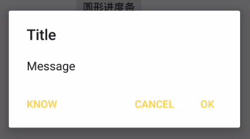
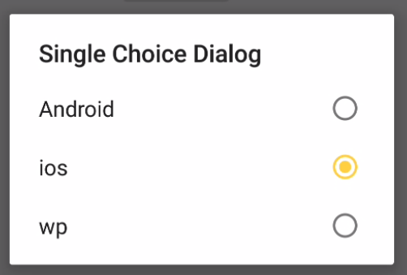
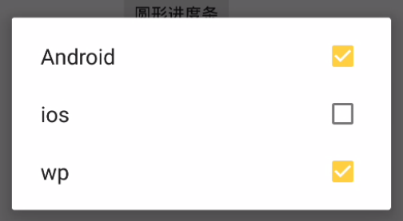
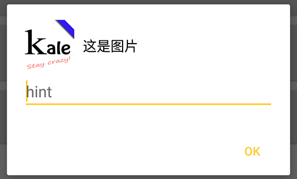

# EasyDialog   
[](https://jitpack.io/#tianzhijiexian/EasyDialog)  

提供自定义Dialog style的库，非自定义view，纯净原生！   

### 简介  
>原生的Dialog提供了很多Style来让开发者进行自定义，如果还不能满足要求，那么可以通过替换Dialog默认的布局来做。

这其实是android的设计思想，官方“一般”都会把属性值暴露出来，我们编码时也可以采取这样的思路，让显示和逻辑分开。因此，本项目并没有重新实现Dialog，而是通过封装了DialogFragment来让大家使用和定制Dialog更加的方便。

### 添加依赖
1.在项目外层的build.gradle中添加JitPack仓库

```  
repositories {
	maven {
		url "https://jitpack.io"
	}
}
```    

2.在用到的项目中添加依赖

> compile 'com.github.tianzhijiexian:EasyDialog:[Latest release](https://github.com/tianzhijiexian/EasyDialog/releases)(<-click it)'  


**举例：**    
> compile 'com.github.tianzhijiexian:EasyDialog:1.0.6'

### 使用方式   

**1. 最简单的对话框**   

  

```JAVA  
EasyDialog.Builder builder = new EasyDialog.Builder();
builder.setTitle("Title")
        .setMessage(R.string.hello_world)
        .setOnCancelListener(new OnCancelListener() {
            public void onCancel(DialogInterface dialog) {
                // onCancel - > onDismiss
            }
        })
        .setOnDismissListener(new OnDismissListener() {
            public void onDismiss(DialogInterface dialog) {

            }
        })
        .setNeutralButton("know", null)
        .setPositiveButton("ok", new OnClickListener() {
            public void onClick(DialogInterface dialog, int which) {
                Log.d(TAG, "onClick ok");// 设置对话框上的按钮 ok->dismiss
            }
        })
        .setNegativeButton("cancel", new OnClickListener() {
            public void onClick(DialogInterface dialog, int which) {
                Log.d(TAG, "onClick cancel");
                dialog.dismiss(); // cancel -> dismiss
            }
        });

EasyDialog dialog = builder.build();
dialog.setCancelable(true); // 点击空白是否可以取消
dialog.show(getSupportFragmentManager(), TAG);
```    
**2. 单选对话框**   

  

```JAVA
EasyDialog dialog = new EasyDialog.Builder()
        .setTitle("Single Choice Dialog")
        .setSingleChoiceItems(new String[]{"Android", "ios", "wp"}, 1, new OnClickListener() {
            @Override
            public void onItemClick(DialogInterface dialog, int position) {
                Log.d(TAG, "onItemClick pos = " + position);
            }
        })
        .build();
dialog.setCancelable(false);
dialog.show(getSupportFragmentManager());
```  
**3. 多选对话框**   

    

```JAVA
new EasyDialog.Builder()
        .setMultiChoiceItems(
				new String[]{"Android", "ios", "wp"},
				new boolean[]{true, false, true},
				new OnMultiChoiceClickListener() {
            @Override
            public void onClick(DialogInterface dialog, int which, boolean isChecked) {
                Log.d(TAG, "onClick pos = " + which + " , isChecked = " + isChecked);
            }
        })
        .build().show(getSupportFragmentManager(), TAG);
```  

**4. 自定义对话框**

  

```JAVA
dialog = new DemoSimpleDialog.Builder()
          .setImageBitmap(BitmapFactory.decodeResource(getResources(), R.drawable.kale))
          .setInputText("", "hint")
          .setMessage("这是图片")
          .setPositiveButton("ok", new DialogInterface.OnClickListener() {
              @Override
              public void onClick(DialogInterface ignore, int which) {

              }
          })
          .build();
        dialog.show(getSupportFragmentManager(), TAG);
```

### 自定义对话框   
自定义对话框需要继承自`BaseCustomDialog`。如果需要传入更多的参数，还需要继承自`EasyDialog.Builder`来建立自己的builder。  

```JAVA
public class DemoDialog extends BaseCustomDialog {
	public static final String KEY_NUM = "KEY_NUM";
    /**
     * 继承自{@link kale.ui.view.BaseEasyDialog.Builder}以扩展builder
     */
    public static class Builder extends BaseEasyDialog.Builder<DemoDialog.Builder> {

        private Bundle bundle = new Bundle();

        /**
         * 扩展一个方法来传入参数
         */
        public Builder setSomeArg(int i) {
            bundle.putInt(KEY_NUM, i);
            return this;
        }

        @NonNull
        @Override
        protected BaseEasyDialog createDialog() {
            BaseEasyDialog dialog = new DemoDialog();
			dialog.setArguments(bundle); // 增加自己的bundle
        }

		@Override
		protected int getLayoutResId() {
			return R.layout.custom_dialog;
		}

		@Override
		protected void bindViews(View root) {

		}

		@Override
		protected void setViews() {
			getDialog().getWindow().setBackgroundDrawable(new ColorDrawable()); // 不显示dialog背景

		}

    }

}
```

### 自定义样式  
**在主题中设置默认样式（如果你想用原生的样式，可以跳过这个步骤）**  
```XML  
<resources>

    <style name="AppTheme" parent="Theme.AppCompat.Light.DarkActionBar">
        <!-- Customize your theme here. -->

        <item name="alertDialogTheme">@style/Theme.Dialog.Alert</item>

    </style>

</resources>
```     

```XML
<style name="Theme.Dialog" parent="Theme.AppCompat.Light.Dialog">
        <item name="windowActionBar">false</item>
        <!-- 没有标题栏 -->
        <item name="windowNoTitle">true</item>

        <!--边框-->
        <item name="android:windowFrame">@null</item>

        <!--是否浮现在activity之上-->
        <item name="android:windowIsFloating">true</item>

        <!-- 是否透明 -->
        <item name="android:windowIsTranslucent">true</item>

        <!--除去title-->
        <item name="android:windowNoTitle">true</item>

        <!-- 对话框是否有遮盖 -->
        <item name="android:windowContentOverlay">@null</item>

        <!-- 对话框出现时背景是否变暗 -->
        <item name="android:backgroundDimEnabled">true</item>

        <!-- 背景颜色，因为windowBackground中的背景已经写死了，所以这里的设置无效 -->
        <item name="android:colorBackground">@color/background_floating_material_light</item>

        <!-- 着色缓存（一般不用）-->
        <item name="android:colorBackgroundCacheHint">@null</item>

        <!-- 标题的字体样式 -->
        <item name="android:windowTitleStyle">@style/RtlOverlay.DialogWindowTitle.AppCompat</item>
        <item name="android:windowTitleBackgroundStyle">@style/Base.DialogWindowTitleBackground.AppCompat</item>

        <!--对话框背景(重要)-->
        <item name="android:windowBackground">@drawable/abc_dialog_material_background_light</item>

        <!-- 动画 -->
        <item name="android:windowAnimationStyle">@style/Animation.AppCompat.Dialog</item>

        <!-- 输入法弹出时自适应 -->
        <item name="android:windowSoftInputMode">stateUnspecified|adjustPan</item>

        <item name="windowActionModeOverlay">true</item>

        <!-- 列表部分的内边距，作用于单选、多选列表 -->
        <item name="listPreferredItemPaddingLeft">20dip</item>
        <item name="listPreferredItemPaddingRight">24dip</item>

        <item name="android:listDivider">@null</item>

        <!-- 单选、多选对话框列表文字的颜色 默认：@color/abc_primary_text_material_light -->
        <item name="textColorAlertDialogListItem">#00ff00</item>

        <!-- 单选、多选对话框的分割线 -->
        <!-- dialog中listView的divider 默认：@null-->
        <item name="listDividerAlertDialog">@drawable/divider</item>

        <!-- 单选对话框的按钮图标 (默认不为null)-->
        <item name="android:listChoiceIndicatorSingle">@android:drawable/btn_radio</item>

        <!-- 对话框整体的内边距，但不作用于列表部分 默认：@dimen/abc_dialog_padding_material-->
        <item name="dialogPreferredPadding">120dp</item>

        <item name="alertDialogCenterButtons">true</item>

        <!-- 对话框内各个布局的布局文件-->
        <item name="alertDialogStyle">@style/AlertDialogStyle</item>
    </style>

    <!-- parent="@style/Theme.AppCompat.Light.Dialog.Alert" -->
    <style name="Theme.Dialog.Alert">
        <item name="windowMinWidthMajor">@dimen/abc_dialog_min_width_major</item>
        <item name="windowMinWidthMinor">@dimen/abc_dialog_min_width_minor</item>
    </style>


    <style name="AlertDialogStyle" parent="Base.AlertDialog.AppCompat">
        <!-- AlertController.class - line:168 -->

        <!-- dialog的主体布局文件，里面包含了title，message等控件 -->
        <item name="android:layout">@layout/custom_dialog_alert_material</item>
        <!-- dialog中的列表布局文件，其实就是listView -->
        <item name="listLayout">@layout/custom_dialog_list_material</item>
        <!-- dialog中列表的item的布局 -->
        <item name="listItemLayout">@layout/custom_dialog_select_item_material</item>
        <!-- 多选的item的布局 -->
        <item name="multiChoiceItemLayout">@layout/custom_dialog_select_multichoice_material</item>
        <!-- 单选的item的布局 -->
        <item name="singleChoiceItemLayout">@layout/custom_dialog_select_singlechoice_material</item>

    </style>

```

### 开发者


Jack Tony: <developer-kale@foxmail.com>  

### License

    Copyright 2016-2019 Jack Tony

    Licensed under the Apache License, Version 2.0 (the "License");
    you may not use this file except in compliance with the License.
    You may obtain a copy of the License at

       http://www.apache.org/licenses/LICENSE-2.0

    Unless required by applicable law or agreed to in writing, software
    distributed under the License is distributed on an "AS IS" BASIS,
    WITHOUT WARRANTIES OR CONDITIONS OF ANY KIND, either express or implied.
    See the License for the specific language governing permissions and
    limitations under the License.
